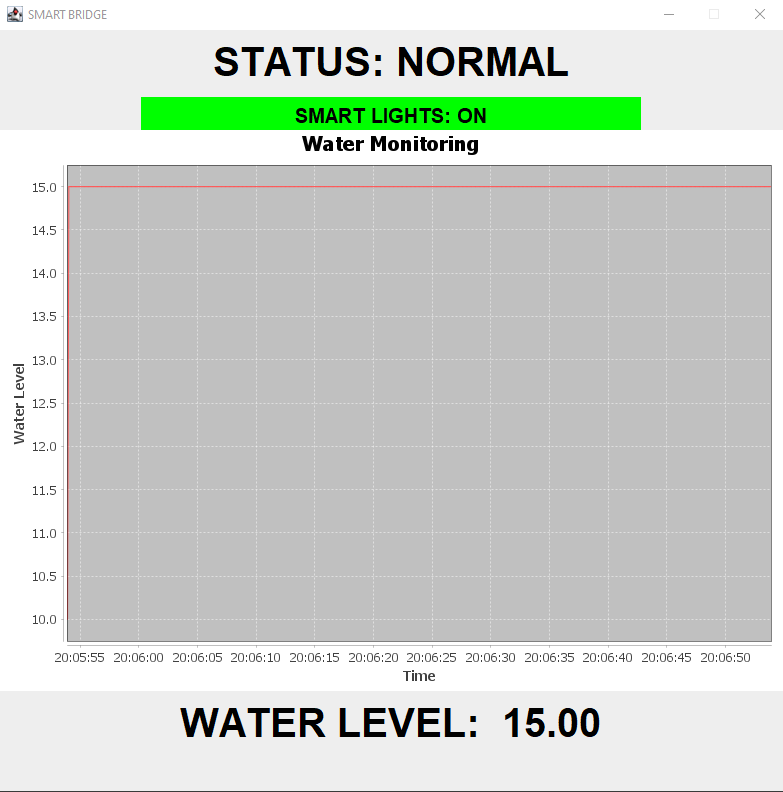

# IoT - SmartBridge 🌉 

___
## **PROJECT DESCRIPTION:**
**This is an University project for the "Embedded Systems and Internet of Things" Exam.**

*This project is the second assignment out of three.*

***Smartbridge*** is an Arduino project where the aim was to create a **prototype of an intelligent bridge** that would automatically manage two distinct functions:

- *Water Level Monitoring & Emergency management.*
- *Automatic Pedestrian Lighting.*

The *Arduino program* is totally based on **object-oriented programming**, and numerous **tasks** are also used using a **multitasking scheduler**.

___
## **JAVA APPLICATION:**

This project also contains a very minimal **JAVA application** that show the user some *important data*:

- *Current Water Level*
- *Current Smart Lights Status*
- *Current Bridge Status*

The Application contains a **real-time graph** of the water level.

Here is the *screenshot* of the **JAVA application**:

  

___
## **FEATURES:**

- Automatic Water Level Monitoring.
- Automatic change of bridge status.
- Automatic change of Valve degrees.
- Ability to switch the Valve from automatic to manual mode.
- Automatic Pedestrian Lights.

___
## **COMPATIBILITY:**

**The arduino program is based on Arduino UNO.**

*The JAVA application can be used with both **Windows** and **Mac** devices.*
___

## **DOCUMENTATION**

There is a folder containing all the documentation:

- The **complete report** of the project.
- The *Wiring Diagram* of the prototype.
- A Screenshot of the *JAVA application*.
- Bridge Status *State Scheme*.
- Smart Lights *State Scheme*.
- Valve *State Scheme*.

___

## **REPORT**

There is a PDF report which explains in detail the **organization, structure and operation of the entire project**.
___
